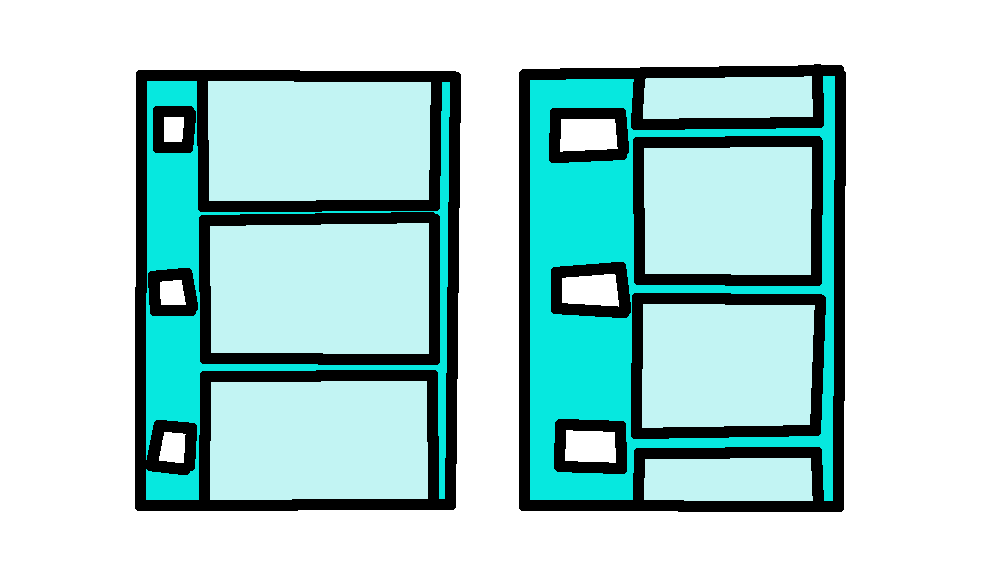
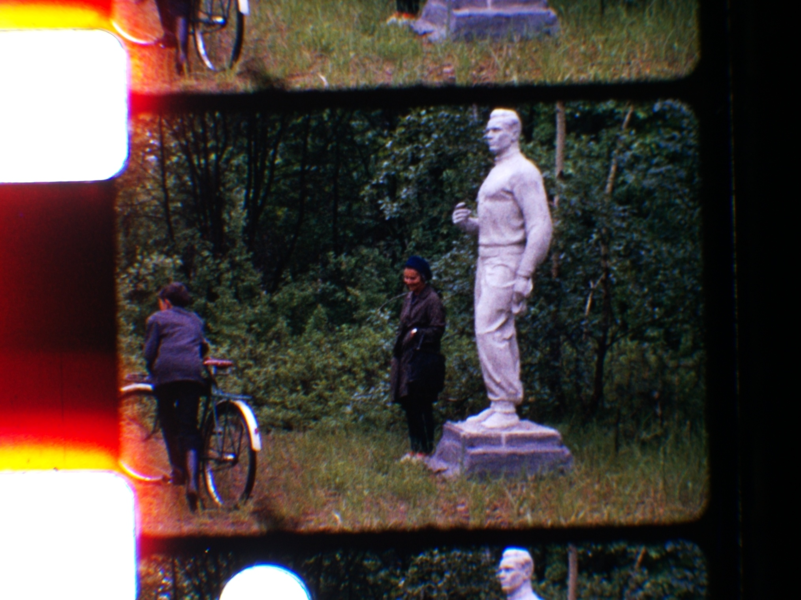

# Anchor reasoning strategy: layout-aware sprocket validation

## The problem with independent per-class processing

The current fuser (`fuse.py`) processes each detection class independently and then selects
a primary anchor by picking the detection closest to the image centre. This fails when a
false detection happens to land closer to the centre than the correct one, because the
fuser has no way to distinguish them without considering the full geometric context.

The failed detection in `picture-00009.jpg` (frame index 8) is a concrete example —
documented below.

---

## Film strip geometry in a typical scan



The scanner is zoomed in to maximise coverage of the frame content area. As a result,
**both corners of the same sprocket hole are rarely visible together**. The typical
visible markers are:

```
  ┌─────────────────────────────────────────────────┐
  │▓▓▓▓▓▓▓▓▓│                                       │ ← image top
  │▓ bottom-│                                       │
  │▓ right  │      film frame content               │
  │▓ of     │                                       │
  │▓ upper  │                                       │
  │▓ hole   │                                       │
  │▓▓▓▓▓▓▓▓▓│  ─────────────────────────────────── │ ← frame seam
  │          │                                       │
  │          │      film frame content               │   (this frame)
  │          │                                       │
  │          │  ─────────────────────────────────── │ ← frame seam
  │▓▓▓▓▓▓▓▓▓│                                       │
  │▓ top-   │      film frame content               │
  │▓ right  │                                       │
  │▓ of     │                                       │
  │▓ lower  │                                       │
  │▓ hole   │                                       │
  └─────────────────────────────────────────────────┘
    ↑                                         ↑
  sprocket strip                        frame seam detections
  (x ≈ constant)                        (right edge of image)
```

The two surviving sprocket detections therefore typically come from **different physical
holes**:

- `sprocket-hole-bottom-right` of the **upper** hole (partially cut off at the top)
- `sprocket-hole-top-right` of the **lower** hole (partially cut off at the bottom)

Both are on the same physical strip, so their x-coordinates should be nearly identical.
The only valid source of x-variation between them is film rotation.

---

## The key geometric constraint

> **All surviving sprocket detections — regardless of class or which hole they belong
> to — must share approximately the same x-coordinate (the right edge of the sprocket
> strip), corrected for the known film rotation.**

Given two detections at `(x_a, y_a)` and `(x_b, y_b)` and a known rotation angle θ:

```
expected_Δx = (y_b − y_a) × tan(θ)
residual    = |(x_b − x_a) − expected_Δx|
```

If `residual > tolerance` (e.g. 15 px), one of the two detections is almost certainly
a false positive.

For a rotation of 1.14° and a vertical span of 700 px, the expected x-drift is about
14 px — comparable to the RANSAC band currently used within a single class. The
cross-class check must therefore be rotation-aware to avoid false rejections on
legitimately rotated reels.

---

## Proposed validation pipeline

The fuser should not choose one raw YOLO anchor and compare that point directly with the
reference frame. Different classes and different physical holes have different y
offsets, so switching between "upper sprocket", "lower sprocket", "top-right corner",
"bottom-right corner", and "frame seam" can create a crop jump even when every detection
is physically valid.

Instead, each detection should be assigned to a **layout role**, projected to the same
canonical frame reference, and fused there.

### Step 1 - Calibrate the reel layout from strong frames

Use frames with clean 3-4 anchor geometry to estimate stable reel-level geometry:

- rotation-corrected x of the left sprocket column
- rotation-corrected x of the right frame-seam column
- seam-to-seam pitch
- Regular 8 sprocket-corner offsets around each seam
- class-specific noise priors:
  - sprocket top/right corners: sharp, high trust
  - sprocket bottom/right corners: sharp but a little lower trust
  - frame seams: useful but fuzzy, lower trust
- slow horizontal drift and rotation

Only high-quality layout fits should update these reel-level values. Weak frames should
consume the current model, not move it.

### Step 2 - Convert detections into role candidates

Treat each YOLO detection as evidence for one or more possible physical roles, not as the
final stabilization anchor.

For a Regular 8 scan, typical roles are:

- top/right corner of the lower visible sprocket hole
- bottom/right corner of the upper visible sprocket hole
- top frame seam on the right edge
- bottom frame seam on the right edge

Zoomed-out frames can expose extra corners from the same holes. Those are valid
detections, but they should receive lower role priors unless the full layout supports
them.

### Step 3 - Apply hard geometry gates before confidence

Confidence should not rescue an impossible location. Before scoring candidates, reject
detections that violate hard layout constraints:

- sprocket corners must be near the learned left sprocket x after rotation correction
- frame seams must be near the learned right seam x after rotation correction
- left sprocket anchors and right seam anchors must have plausible horizontal separation
- two seams must be roughly one pitch apart
- sprocket y must be near the expected signed offset from one of the seam roles
- sprocket detections well inside the content area are invalid unless they also satisfy
  the learned sprocket-column geometry

The rotation-corrected x calculation remains useful:

```
x_corrected(det) = x(det) − (y(det) − y_ref) × tan(θ)
```

But it should be one gate in the layout model, not the entire decision.

### Step 4 - Fit the best layout hypothesis

Build a small set of plausible assignments from detections to physical roles. Score each
assignment by weighted residuals:

```
score =
    x residual against expected left/right column
  + y residual against expected role position
  + pitch residual when two vertical anchors exist
  + rotation residual when separated anchors exist
  - confidence bonus
  - class/role prior bonus
```

Use class-specific tolerances. Sprocket corners should have tighter residual bands than
frame seams because they are usually crisp and can be edge-refined. Frame seams should be
allowed wider y and x residuals because the boundary is fuzzy and can disappear in dark
frames.

### Step 5 - Project every accepted detection to a canonical frame reference

After the best hypothesis is selected, convert each accepted detection into an estimate
of the same canonical frame reference, for example the current frame's top seam y and
left sprocket x.

Examples:

- a lower sprocket top/right corner projects to the nearby seam using the learned Regular
  8 corner-to-seam offset
- an upper sprocket bottom/right corner projects to its nearby seam using the opposite
  signed offset
- a frame seam projects directly to the canonical seam reference

Then combine the projected estimates with confidence and class-prior weights. This avoids
crop jumps when the best visible detection switches between classes or between upper and
lower physical holes.

### Step 6 - Degrade by evidence level

Return a quality tier with the fused anchor:

| Tier | Evidence | Behaviour |
|---|---|---|
| `layout_fit` | 3-4 compatible anchors | Stabilize normally; may update slow x/rotation/layout state |
| `pair_fit` | 2 compatible anchors | Stabilize normally; may update x/rotation cautiously |
| `single_projected` | 1 geometrically plausible anchor | Stabilize from its projected role; do not update layout |
| `seam_only` | only valid seam evidence | Stabilize from seam projection with lower trust |
| `predicted` | no valid detection | Use temporal interpolation / previous slow state |

### Step 7 - Treat y as per-frame only

The y coordinate of the sprockets has **no temporal stability** in this scanner path.
Each scanned frame's vertical jitter is effectively random. Therefore:

- do not smooth y across neighbouring frames
- do not reject a y position just because adjacent frames differ
- do not update y from temporal drift assumptions
- do use same-frame geometry to validate y

Temporal state is appropriate for slow horizontal drift and rotation, but not for frame
y. A single-frame layout fit should produce the y transform for that frame directly.

---

## Why "closest to image centre" is the wrong primary-selection heuristic

For Regular 8mm, the two visible sprocket features sit at the **top and bottom edges**
of the scan — one near the upper frame seam, one near the lower. Neither is inherently
more central than the other. Picking by distance to image centre arbitrarily favours
whichever sprocket appears lower in the frame, with no geometric justification.

The correct discriminator is **layout consistency after role assignment**, not proximity
to the image centre. x-consistency with the established strip position is one important
part of that layout consistency.

---

## Failed detection example: picture-00009 (frame index 8)



```json
{
  "frame_index": 8,
  "image_path": "/home/janne/Videos/terijoki/picture-00009.jpg",
  "detection": {
    "state": "detected",
    "anchor_x": 349.0,
    "anchor_y": 1188.36,
    "label": "? · 0.86 · (349.0, 1188.4) · 6 anchors",
    "anchors": [
      { "label": "sprocket-hole-top-right",    "x": 328.08, "y":   63.35 },
      { "label": "sprocket-hole-top-right",    "x": 349.0,  "y": 1177.44 },
      { "label": "sprocket-hole-bottom-right", "x": 332.18, "y":  470.40 },
      { "label": "sprocket-hole-bottom-right", "x": 352.23, "y": 1520.0  },
      { "label": "frame-seam-right",           "x": 1744.79,"y": 1333.25 },
      { "label": "frame-seam-right",           "x": 1716.85,"y":  214.03 }
    ]
  },
  "reference": { "x": 354.38, "y": 1254.02 },
  "shift": { "dx": 5.38, "dy": 65.66 },
  "rotation_deg": 1.14,
  "sprocket_pitch_px": 1119.07
}
```

### What the detections reveal

The seam detections sit at x ≈ 1716–1744 — correctly at the right edge of the frame
content area. The sprocket detections form two raw x-groups because the film is rotated:

| Detection | x | y | Notes |
|---|---|---|---|
| `top-right` (upper hole) | 328 | 63 | extra visible corner above the current frame |
| `bottom-right` (upper hole) | 332 | 470 | consistent; strip x ≈ **330** |
| `top-right` (lower hole) | **349** | 1177 | expected raw x after rotation over the vertical span |
| `bottom-right` (lower hole) | **352** | 1520 | consistent with the lower top-right; clipped at image boundary |

The upper hole detections establish the left strip position near x ≈ 330 at the top of
the scan. The lower detections land near x ≈ 350 because the reel is rotated by 1.14°:
328 + 1 100 × tan(1.14°) ≈ 350. So the rotation-corrected x-check would **not** reject
the lower detections on x alone.

### Why the detection is still suspect

In this particular scan the scanner happened to be zoomed out enough that **all four
corners of both holes are visible**. This is the unusual case. The bottom-right of the
lower hole lands exactly at y = 1520 — the image boundary — confirming it is partially
cut off. With all four detections geometrically self-consistent (rotation-corrected),
the x-check alone cannot distinguish a real sprocket at the boundary from a false one.

The current fuser picks the lower `top-right` (y = 1177) because it is closer to the
image centre (y = 760) than the upper `top-right` (y = 63). This produces a shift of
dy = +65.66 px relative to the reference frame, which moves the preview image downward
and places the crop in the wrong position.

### What a better system would do

1. **Use the seam y-positions** (y = 214 and y = 1333) as same-frame layout evidence.
   They indicate the current frame boundaries, but they should still be weighted lower
   than clean sprocket corners because seams are fuzzy.

2. **Assign detections to physical roles.** The upper top-right (y = 63) is an extra
   visible corner above the current frame; the lower top-right (y = 1177) is the lower
   sprocket corner associated with the current frame boundary. Both can be real, but
   they project to different canonical seam references.

3. **Cross-validate y within the same frame.** For Regular 8mm, the sprocket hole is
   centred at the frame seam. The lower hole's centre is at (1177 + 1520) / 2 ≈ 1348,
   just 15 px below the lower seam at y = 1333. The upper hole's centre is at
   (63 + 470) / 2 ≈ 266, about 52 px below the upper seam at y = 214. Both are
   consistent with the expected seam-centred geometry; neither is rejected.

4. **Recognise "both corners of same hole visible" as a zoomed-out edge case** and
   assign detections to physical roles before producing the stabilization reference.

5. **Do not use neighbouring frames to fix y.** This frame's y position must be decided
   from this frame's detections only. Adjacent frame y values are not evidence because
   vertical transport jitter is random from frame to frame.

The root cause of the bad crop in this frame is not that the selected detection is
obviously fake. It is that the fuser chooses a raw detection as the primary anchor instead
of first mapping every valid detection to the same canonical frame reference. The
x-outlier check is a useful first filter, but it cannot resolve ambiguity when multiple
detections are geometrically consistent with the known rotation.

---

## Summary of proposed changes to `fuse.py`

| Current behaviour | Proposed behaviour |
|---|---|
| RANSAC on `top-right` x only | Hard geometry gates across sprocket and seam classes |
| x tolerance: 30 px (flat) | Rotation-corrected x residuals against learned left/right columns |
| Primary: closest to image centre | Best layout-role assignment, then weighted projection to canonical frame reference |
| Raw selected detection becomes anchor | Every accepted detection projects to the same canonical reference before fusion |
| No seam-guided validation | Same-frame seam/sprocket geometry validates y |
| Fallback: highest-confidence surviving detection | Evidence tiers: layout fit, pair fit, single projected, seam-only, predicted |
| Temporal assumptions implicit | y is never temporally smoothed; only x and rotation use slow temporal state |
